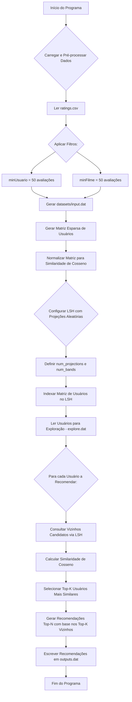

# Sistema de Recomendação 

 <table> <tr> <td>
 
### 📖 Sumário
- [Introdução](#introducao)
  - [O que são Sistemas de Recomendação?](#o-que-sao-sistemas-de-recomendacao)
  - [Objetivos do Trabalho](#objetivos-do-Trabalho)
- [Metodologia](#metodologia)
  - [Organização do Trabalho](#organizacao-do-trabalho)
  - [Processamento dos Dados](#processamento-dos-dados)
  - [Ferramentas Utilizadas](#ferramentas-utilizadas)
- [Análise de Performance](#analise-de-performance)
  - [Comportamento](#comportamento)
  - [Avaliação Geral](#avaliacao-geral)
- [Compilação e Execução](#compilação-entradas-e-saídas)
  - [MakeFile](#makefile)
  - [Input.dat](#input.dat)
  - [Explore.dat](#explore.dat)
  - [Output.dat](#output.dat)
- [Conclusão](#conclusao)
- [Referências](#referências)
- [Autores](#autores)
- [Agradecimentos](#agradecimentos)

</td> <td>

 

</td> </tr> </table> 

# Introdução
 Este trabalho consiste no desenvolvimento de um sistema de recomendação que, a partir de perfis de usuários e características de itens, seja capaz de sugerir agrupamentos de elementos
 similares. Utilizando ....
 <!--- resumo da metodologia, fazer referêndcia a livros e qualquer material que utilizamos --->
 <!--- deixar os calculos por aqui também? --->
  Cálculos como medida de distância euclidiana, similaridade do cosseno ou Jaccard
 devem ser considerados como alternativas. Avaliação conforme critérios de eficiência computacional, qualidade dos resultados, organização do código e documentação, conforme descrito a seguir.
 
## O que são Sistemas de Recomendação?

## Compilação e Execução
 Pré-processamento: O pré-processamento deverá seguir os seguintes critérios:
 • Utilizar apenas usuários que tenham realizado pelo menos 50 avaliações distintas.
 • Utilizar apenas filmes avaliados por pelo menos 50 usuários.
 • Remover registros duplicados ou inconsistentes.
 • Gerar arquivo de entrada no seguinte formato:
 usuario_id item_id1:nota1 item_id2:nota2 item_id3:nota3 ...
 Exemplo: 123 12:4.0 54:3.5 76:5.0 145:2.0
 Note que, cada linha representa um usuário (usuario_id) e suas respectivas avaliações (item_id:nota)
 
 Para o arquivo que será utilizado como fonte de informação para a execução das recomendações, tem-se como padrões a serem seguidos:
 Trabalho Final
 Page 1
• Nomedoarquivo: input.dat
 • Localização: Diretório datasets/
 • Formato: Texto puro (UTF-8)
 • Necessidade: Arquivo que representará a base de dados para exploração

 Já para os arquivos de exploração e de saída, espera-se que ambos sigam os seguintes
 padrões:
 • Nome do arquivo: explore.dat
 • Localização: Diretório datasets/
 • Formato: Texto puro (UTF-8)
 • Necessidade: Arquivo que conterá os usuários utilizados para exploração das recomen
dações
 • Nome do arquivo: output.dat
 • Localização: Diretório outcome/
 • Formato: Texto puro (UTF-8)
 • Necessidade: Arquivo contendo as K recomendações para cada usuário apresentados
 no arquivo explore.dat

 Para cada usuario_id listado, o procedimento a ser seguido consiste em:
 • Realizar a busca na base de dados para identificar os filmes previamente avaliados por
 este usuário.
 • A partir desse conjunto de avaliações, calcular a similaridade ou afinidade do usuário em
 relação aos demais usuários da base, utilizando a métrica de distância ou similaridade
 definida pelo projeto.
 Trabalho Final
 Page 2
• Selecionar os K usuários mais similares (de maior afinidade) ao usuário em análise.
 • Identificar os filmes avaliados positivamente pelos usuários similares, mas ainda não
 avaliados pelo usuário-alvo, priorizando aqueles com maior grau de sobreposição de interesse.
 • A partir dessa análise, gerar as recomendações a serem atribuídas a cada usuario_id.
 Os resultados deste processo deverão ser armazenados no arquivo output.dat, obedecendo
 o formato estipulado, em que cada linha corresponde a um usuario_id seguido pelos item_ids
 recomendados

 O arquivo output.dat deverá conter o formato abaixo, sendo o número de recomendações
 (Top-N) será definido via constante global no arquivo config.h.
 usuario_id item_id1 item_id2 item_id3 ...
 Exemplo: 123 54 76 145

# Metodologia

## Lógica Utilizada

A lógica de desenvolvimento do sistema de recomendação segue uma ordem de implementação que consiste em:

### Pré-processamento

### Aplicação de Filtros

### Gerar Input

### Criação da Matriz Esparsa

A partir de input.dat, é construída uma matriz de usuários esparsa. Essa matriz é representada internamente por um `unordered_map<int, unordered_map<int, float>>`, onde:

- A primeira chave (int) é o userId.

- O unordered_map interno mapeia movieId `int` para a nota `float`.

A matriz implementada é esparsa e armazena apenas avaliações existentes (não-nulas), economizando memória significativa para um dataset massivo como o MovieLens 25M.

Durante a construção, também é criado um mapeamento de movieId para um índice contínuo `filme_indice`, essencial para o alinhamento com os vetores de projeção aleatória do LSH.

As avaliações de cada usuário são normalizadas (divididas pela norma L2 de seu vetor de avaliações) para que o produto escalar direto possa ser usado para calcular a Similaridade de Cosseno (esta parte é feita pela função `normalizarMatriz`) .

Por fim, a matriz esparsa de usuários fica no seguinte formato:

| Usuário ID | Filme 101 | Filme 205 | Filme 330 | Filme 402 | ... |
|------------|-----------|-----------|-----------|-----------|-----|
| 1001       | 0.25      | 0.43      | ---       | 0.77      | ... |
| 1002       | ---       | 0.58      | 0.64      | ---       | ... |
| 1003       | 0.36      | ---       | 0.49      | 0.61      | ... |
| ...        | ...       | ...       | ...       | ...       | ... |

- `---` indica ausência de avaliação (zero implícito na matriz esparsa).
- Os valores são **notas já normalizadas** (norma L2 = 1 por linha).

### Implementar LSH com Random Projections

### Definir num_projections e num_bands

### Ler Usuário Para Recomendação (explore.dat)

A leitura de usuários para recomendação é feita com base em um arquivo `explore.dat`, estes usuários receberão as recomendações. Esta leitura é feita pela função `explorador`.

- A função começa abrindo o arquivo explore.dat, que está localizado dentro da pasta datasets/.

- Um loop while (arquivo >> userId) lê os IDs dos usuários. Este método de leitura é eficiente para arquivos onde cada ID está em uma linha separada ou são separados por espaços. Ele continua lendo enquanto houver inteiros válidos no arquivo.

- Cada userId lido é imediatamente adicionado a `vector<int> usuarios`, que acumula todos os identificadores.

- Após ler todos os IDs, o arquivo é fechado para liberar os recursos.

- Por fim a função retorna o vetor usuarios, que agora contém a lista completa de IDs de usuários para os quais o sistema deve processar as recomendações.

### Definir Vizinhos Candidatos com o LSH

### Calcular Similaridade de Cosseno entre Usuários e Vizinhos

A função `similaridade_cosseno` é implementada para tirar proveito da normalização prévida das notas dos usuários. Ela recebe dois `unordered_map`s que representam os vetores de avaliação esparsos dos usuários (já normalizados).

A função `similaridade_cosseno`:

- Percorre os filmes avaliados por um usuário (userA).

- Para cada filme avaliado por userA, verifica se o outro usuário (userB) também avaliou o mesmo filme (userB.count(filmeID)).

- Se sim, o produto das notas (já normalizadas) desses filmes é somado (notaA * userB.at(filmeID)).

- O resultado final é o produto escalar, que, devido à normalização prévia, é diretamente a similaridade de cosseno.

### Gerar Recomendações com Base nos Melhores Vizinhos

**negrito**
*italico*

| Função            | Descrição                                                  |
|-------------------|------------------------------------------------------------|
| [`nomw`](link)  | resumo da função  |

## Comportamento
Assim como no [Jogo da Vida][1] (J. Conway, 1970), a propagação do fogo na matriz é baseada em *Autômatos Celulares*, um modelo computacional introduzido por John von Neumann e amplamente explorado por Stephen Wolfram em sua obra: [A New Kind of Science (2002)][2]. Autômatos celulares consistem em células organizadas em uma grade, onde cada célula possui um estado (como “árvore”, “fogo” ou “zona segura” dentro da matriz "floresta") e evolui ao longo do tempo de acordo com regras locais e discretas. Essa abordagem é ideal para simular fenômenos naturais como incêndios florestais, ou condições de vida como no jogo do Conway, em que cada célula depende do estado de suas vizinhas.

# Compilação, Entradas e Saídas
## Makefile
O programa é executado por um Makefile, arquivo de texto que automatiza o processo de compilação, que interage com todos os arquivos dentro da pasta "src". 
Este apresenta os seguintes comandos:

&nbsp;&nbsp;&nbsp;&nbsp;**make:** Compila o projeto

&nbsp;&nbsp;&nbsp;&nbsp;**make clean:** Remove os arquivos

&nbsp;&nbsp;&nbsp;&nbsp;**make run:** Compila o projeto (se necessário) e depois executa o programa.

&nbsp;&nbsp;&nbsp;&nbsp;**make c:** make clean + make run

[Script do Makefile utilizado (C++)](Makefile)

# Referências
- [Documento - Trabalho Final](docs/trabalho-final.pdf)
- [1]: https://doi.org/10.1145/2827872
- *F. Maxwell Harper and Joseph A. Konstan. 2015. The MovieLens Datasets: History and Context. ACM Transactions on Interactive Intelligent Systems (TiiS) 5, 4: 19:1–19:19.*

# Autores

### Arthur Santana de Mesquita

 
  
  
 	
  
  

### Arthur de Oliveira Mendonça 

 
  
  
 	
  
  

### João Antônio 

 
  
  
 	
  
  

### Júlia de Moura Souza

 
  
  
 	
  
  

# Agradecimentos
