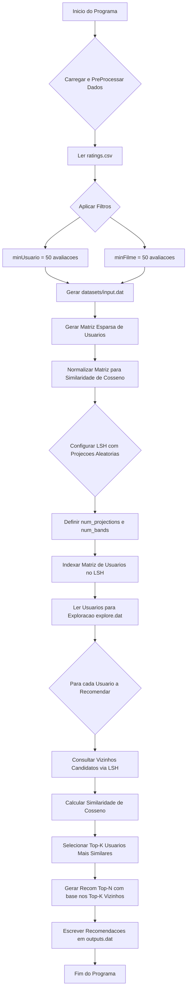

# Sistema de Recomendação 

 <table> <tr> <td>
 
### 📖 Sumário
- [Introdução](#introducao)
- [Metodologia](#metodologia)
  - [Processamento dos Dados](#processamento-dos-dados)
  - [Criação da Matriz Esparsa](#criacao-da-matriz-esparsa)
  - [Implementação do LSH com Projeções Aleatórias](#implementacao-do-lsh-com-projecoes-aleatorias)
  - [Configuração de Parâmetros LSH](#configuracao-de-parametros-lsh)
  - [Medidas de Similaridade](#medidas-de-similaridade)
  - [Geração de Recomendações](#geracao-de-recomendacoes)
- [Compilação e Execução](#compilacao-e-execucao)
- [Análise de Performance](#analise-de-performance)
- [Referências](#referencias)
- [Autores](#autores)
- [Agradecimentos](#agradecimentos)

</td> <td>
 
</td> </tr> </table> 

# Introdução
Um sistema de recomendação é um algoritmo usado para sugerir produtos com base nos interesses e comportamentos dos usuários. Ele analisa dados como histórico de compras, avaliações ou interações para prever o que o usuário pode gostar.

Existem três tipos principais: _filtragem colaborativa_ (baseada em preferências de usuários semelhantes), _filtragem baseada em conteúdo_ (que recomenda itens com características parecidas aos já consumidos) e _sistemas híbridos_, que combinam os dois. Esses sistemas são amplamente utilizados em plataformas como Netflix, Amazon e Spotify para oferecer uma experiência mais personalizada.

Este trabalho consiste no desenvolvimento de um sistema de recomendação do tipo 'filtragem colaborativa', que, a partir de perfis de usuários e características de itens, seja capaz de sugerir agrupamentos de elementos similares. O sistema utiliza o algoritmo Locality Sensitive Hashing (LSH) com Projeções Aleatórias para otimizar a busca por vizinhos similares em grandes datasets. Para garantir alta performance e escalabilidade, o sistema emprega *Multithreads* (paralelismo) em diversas etapas críticas, como o pré-processamento de dados e a construção do índice LSH, além de otimizações de I/O para leitura eficiente de arquivos.

# Metodologia

***Organização do Trabalho***: A lógica de desenvolvimento do sistema de recomendação segue a ordem de implementação do fluxograma abaixo:

📊 Fluxo do Algoritmo (clique para expandir)

### Processamento dos Dados
A primeira etapa do sistema é um pré-processamento robusto e eficiente dos dados brutos, contidos em datasets/ratings.csv. Esta fase é crucial para limpar e preparar os dados para a modelagem, garantindo performance e qualidade.

A lógica de processamento está encapsulada principalmente no arquivo `PreProcessamento.cpp`. As principais características são:

- Leitura Eficiente com `mmap`: Para evitar o alto custo de I/O de ler um arquivo grande linha por linha, o sistema mapeia o arquivo diretamente na memória usando mmap. Isso permite um acesso muito mais rápido e eficiente aos dados.
- Processamento Paralelo: O sistema utiliza múltiplas threads (`std::thread`) para processar o arquivo em paralelo. O arquivo é dividido em blocos, e cada thread trabalha em uma seção para identificar os dados de cada usuário.
- Filtragem de Dados: Para reduzir a esparsidade da matriz e garantir que as recomendações sejam baseadas em dados relevantes, um filtro é aplicado:
  - Usuários com menos de `config::minAval` avaliações são descartados.
  - Filmes com menos de `config::minUsers` avaliações são descartados.
- Saída Estruturada: Após a limpeza, os dados válidos são escritos no arquivo `datasets/input.dat` em um formato otimizado para a próxima fase. Cada linha representa um usuário, seguido por uma lista de `filmeId:nota`.
  
### Criação da Matriz Esparsa

Após o pré-processamento, o arquivo `input.dat` é usado para construir uma matriz de utilidade (usuário-filme). Como a maioria dos usuários não avaliou a maioria dos filmes, esta matriz é naturalmente esparsa.

A implementação utiliza uma estrutura de dados eficiente para representar essa esparsidade:
- Representação da Matriz: A matriz é representada como um `std::unordered_map` onde a chave é o `userID` e o valor é outro `std::unordered_map` que mapeia `movieID` para nota. Isso evita alocar espaço para as milhões de entradas vazias da matriz.
- Normalização de Vetores: Durante a criação da matriz na função `criarMatrizUsuarios`, os vetores de avaliação de cada usuário são normalizados. A função `normalizarMatriz` calcula a norma L2 do vetor de notas de um usuário e divide cada nota por essa norma. Esta normalização é fundamental, pois permite que a Similaridade de Cosseno seja calculada de forma otimizada posteriormente, usando apenas o produto escalar.

### Implementação do LSH com Projeções Aleatórias
Para evitar o cálculo de similaridade entre todos os pares de usuários (complexidade de O(n²)), o projeto implementa LSH, uma técnica que agrupa usuários potencialmente similares em "baldes" (buckets) com alta probabilidade. O processo, detalhado em `construirIndiceLSH`, ocorre em três etapas principais:

1 - Geração de Hiperplanos Aleatórios: São gerados `config::numHiperplanos` vetores aleatórios (hiperplanos), onde a dimensionalidade de cada vetor é igual ao número total de filmes únicos.

2 - Criação de Assinaturas (Signatures): Para cada usuário, é gerada uma assinatura binária. Essa assinatura é obtida calculando o produto escalar entre o vetor de notas (normalizado) do usuário e cada um dos hiperplanos. Se o resultado for positivo, o bit correspondente na assinatura é `1`; caso contrário, é `0`. Isso projeta o vetor de alta dimensão do usuário em um espaço de dimensão muito menor (a assinatura).

3 - Hashing em Bandas (Banding): A assinatura de cada usuário é dividida em `config::numBandas` bandas. Cada banda é então usada como uma chave de hash. Usuários que possuem pelo menos uma banda idêntica são colocados no mesmo balde. A colisão em um balde indica que eles são candidatos a serem similares. Todo o processo de criação de assinaturas e agrupamento em baldes é paralelizado para máxima performance.

### Configuração de Parâmetros LSH

As constantes `numHiperplanos`, `numBandas` e `bitsPorBanda` são cruciais para o ajuste fino do algoritmo LSH, balanceando a precisão e a eficiência. Elas são definidas no arquivo `config.hpp`:

- **`numHiperplanos`**: Define o número total de projeções aleatórias usadas para gerar a assinatura LSH de cada usuário. Um valor maior aumenta a granularidade da assinatura, potencialmente melhorando a precisão na identificação de usuários similares, mas também eleva o custo computacional da construção e consulta do índice. No código atual, `numHiperplanos` está configurado para `16`.
- **`numBandas`**: Determina em quantas sub-assinaturas (bandas) a assinatura LSH completa é dividida. O bucketing é realizado por banda. Um número maior de bandas pode aumentar o *recall* (a capacidade de encontrar todos os vizinhos verdadeiros), mas também pode gerar mais candidatos falsos positivos se as bandas forem muito pequenas. Atualmente, `numBandas` é `16`.
- **`bitsPorBanda`**: Indica quantos bits de cada assinatura LSH compõem uma única banda. A relação fundamental entre esses parâmetros é `numHiperplanos = numBandas * bitsPorBanda`. No código, `bitsPorBanda` é `8`.

### Medidas de Similaridade

O sistema utiliza a Similaridade de Cosseno para medir o quão parecidos são dois usuários. A estratégia é dividida em duas fases para otimização:

1 - Aproximação com LSH: A técnica de LSH com projeções aleatórias serve como uma aproximação da similaridade de cosseno. Ao agrupar usuários em baldes, o LSH identifica rapidamente um conjunto de candidatos a vizinhos próximos, eliminando a necessidade de comparar um usuário com todos os outros. A função `encontrarCandidatosLSH realiza` essa busca.

2 - Cálculo Preciso da Similaridade: Uma vez que um conjunto menor de candidatos é obtido via LSH, a similaridade de cosseno exata é calculada entre o usuário-alvo e cada um dos seus candidatos. Como os vetores de avaliação já foram normalizados na etapa de criação da matriz, o cálculo é otimizado para ser apenas o produto escalar entre os vetores dos dois usuários.

### Geração de Recomendações

O processo final de geração de recomendações é feito pela função `gerarRecomendacoesLSH` e segue os passos clássicos de um sistema de filtragem colaborativa baseado em usuário:

- Leitura dos Usuários-Alvo: O sistema lê os usuários para os quais deve gerar recomendações a partir do arquivo `datasets/explore.dat`.
- Encontrar Vizinhos Próximos:  
  1 - Usa o índice LSH para obter uma lista de usuários candidatos (`encontrarCandidatosLSH`).  
  2 - Calcula a similaridade de cosseno com cada candidato.  
  3 - Utiliza uma `priority_queue` (heap) para manter de forma eficiente os K vizinhos mais similares.
- Calcular Scores dos Itens: O sistema agrega as notas dos filmes avaliados pelos `K` vizinhos, dando um peso maior para os filmes avaliados pelos vizinhos mais similares. Apenas filmes que o usuário-alvo ainda não avaliou são considerados.
- Selecionar Top-N Recomendações: Uma segunda `priority_queue` é usada para ordenar os filmes candidatos pelos seus scores agregados e selecionar os `N` melhores.
- Escrever Saída: As recomendações finais são escritas no arquivo `outcome/output.dat`, com cada linha contendo o `userID` seguido dos `IDs` dos filmes recomendados.
Todo este pipeline, da busca de candidatos à geração da lista final, é executado em paralelo por um pool de threads para processar múltiplos usuários simultaneamente.

# Compilação e Execução

O projeto utiliza C++ e pode ser compilado e executado usando um `Makefile`. As dependências e a estrutura do projeto foram atualizadas para incluir:

Para compilar e executar o projeto, siga os passos:

1.  **Pré-requisitos**: Certifique-se de ter um compilador C++ (como g++) e `make` instalados em seu sistema.
2.  **Navegar até o diretório do projeto**: Abra um terminal e navegue até o diretório raiz do projeto.
3.  **Comandos do Makefile**:
    -   `make`: Compila o projeto, criando os executáveis necessários.
    -   `make clean`: Remove os arquivos de compilação gerados (objetos e executáveis).
    -   `make run`: Compila o projeto (se necessário) e executa o programa principal.
    -   `make c`: Uma combinação de `make clean` e `make run`, útil para recompilar e executar o projeto do zero.

O programa gerará o arquivo `input.dat` no diretório `datasets/` após o pré-processamento e o arquivo `output.dat` no diretório `outcome/` com as recomendações geradas.

# Máquinas de Testes

# Análise de Performance

As otimizações implementadas, especialmente o uso extensivo de paralelismo com `std::thread` no pré-processamento e na construção do índice LSH, resultaram em ganhos significativos de performance. A divisão de tarefas entre múltiplas threads e a otimização da leitura de arquivos com buffers maiores contribuem para uma execução mais rápida, especialmente com grandes volumes de dados. Isso permite que o sistema processe datasets maiores em um tempo reduzido, tornando-o mais escalável e eficiente para aplicações do mundo real.

# Referências
- [Documento - Trabalho Final](docs/trabalho-final.pdf)
- *F. Maxwell Harper and Joseph A. Konstan. 2015. The MovieLens Datasets: History and Context. ACM Transactions on Interactive Intelligent Systems (TiiS) 5, 4: 19:1–19:19.*

<table style="margin: 0 auto; text-align: center;">
<tr>
  <td valign="top" style="text-align: center;">
    <strong>Alunos</strong>  
     
    <strong>João Antonio</strong> 
      
     
    <strong>Arthur Mendonça</strong> 
      
     
    <strong>Arthur Santana</strong> 
      
     
    <strong>Júlia D'Moura</strong> 
    
  </td>
  <td valign="top" style="text-align: center;">
    <strong>Professor</strong>  
     
    <strong>Prof. Michel Pires</strong> 
    
  </td>
</tr>
</table>

# Agradecimentos

