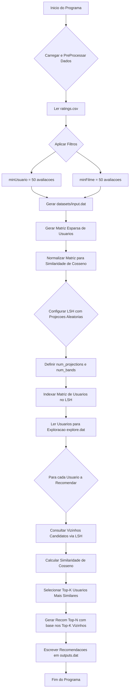

<div align="center"> <table> <tr> <td>
 
### 📖 Sumário
- [Introdução](#introducao)
- [Metodologia](#metodologia)
  - [Processamento dos Dados](#processamento-dos-dados)
  - [Criação da Matriz Esparsa](#criacao-da-matriz-esparsa)
  - [Implementação do LSH com Projeções Aleatórias](#implementacao-do-lsh-com-projecoes-aleatorias)
  - [Configuração de Parâmetros LSH](#configuracao-de-parametros-lsh)
  - [Medidas de Similaridade](#medidas-de-similaridade)
  - [Geração de Recomendações](#geracao-de-recomendacoes)
- [Compilação e Execução](#compilacao-e-execucao)
- [Análise de Performance](#analise-de-performance)
- [Referências](#referencias)
- [Autores](#autores)
- [Agradecimentos](#agradecimentos)

</td> <td>
 
</td> </tr> </table> </div>

# Introdução
Um sistema de recomendação é um algoritmo usado para sugerir produtos com base nos interesses e comportamentos dos usuários. Ele analisa dados como histórico de compras, avaliações ou interações para prever o que o usuário pode gostar.

Existem três tipos principais: _filtragem colaborativa_ (baseada em preferências de usuários semelhantes), _filtragem baseada em conteúdo_ (que recomenda itens com características parecidas aos já consumidos) e _sistemas híbridos_, que combinam os dois. Esses sistemas são amplamente utilizados em plataformas como Netflix, Amazon e Spotify para oferecer uma experiência mais personalizada.

Este trabalho consiste no desenvolvimento de um sistema de recomendação do tipo 'filtragem colaborativa', que, a partir de perfis de usuários e características de itens, seja capaz de sugerir agrupamentos de elementos similares. O sistema utiliza o algoritmo Locality Sensitive Hashing (LSH) com Projeções Aleatórias para otimizar a busca por vizinhos similares em grandes datasets. Para garantir alta performance e escalabilidade, o sistema emprega *Multithreads* (paralelismo) em diversas etapas críticas, como o pré-processamento de dados e a construção do índice LSH, além de otimizações de I/O para leitura eficiente de arquivos.

# Metodologia

***Organização do Trabalho***: A lógica de desenvolvimento do sistema de recomendação segue a ordem de implementação do fluxograma abaixo:
<details>
<summary>📊 Fluxo do Algoritmo (clique para expandir)</summary>



</details>

### Processamento dos Dados
A primeira etapa do sistema é o pré-processamento dos dados brutos, contidos em `datasets/ratings.csv`. Esta fase é crucial para limpar e preparar os dados para a modelagem, garantindo performance e qualidade.

A lógica de processamento está encapsulada principalmente no arquivo `PreProcessamento.cpp`. As principais características são:
- Leitura Eficiente com mmap: Para evitar o alto custo de I/O de ler um arquivo grande linha por linha, o sistema mapeia o arquivo diretamente na memória usando `mmap`. Isso permite um acesso muito mais rápido e eficiente aos dados.
- Processamento Paralelo: O sistema utiliza múltiplas threads (`std::thread`) para processar o arquivo em paralelo. O arquivo é dividido em blocos, e cada thread trabalha em uma seção para identificar os dados de cada usuário.
- Filtragem de Dados: Para reduzir a esparsidade da matriz e garantir que as recomendações sejam baseadas em dados relevantes, um filtro é aplicado:
  - Usuários com menos de `config::minAval` avaliações são descartados.
  - Filmes com menos de `config::minUsers` avaliações são descartados.
- Saída Estruturada: Após a limpeza, os dados válidos são escritos no arquivo `datasets/input.dat` em um formato otimizado para a próxima fase. Cada linha representa um usuário, seguido por uma lista de filmeId:nota.

### Criação da Matriz Esparsa

A partir do `input.dat`, é construída uma matriz de usuários esparsa, representada internamente por um `unordered_map<int, unordered_map<int, float>>`. Esta estrutura armazena apenas avaliações existentes, economizando memória para datasets massivos como o MovieLens 25M. Durante a construção, também é criado um mapeamento de `movieId` para um índice contínuo (`filme_indice`), essencial para o alinhamento com os vetores de projeção aleatória do LSH. As avaliações de cada usuário são normalizadas (divididas pela norma L2 de seu vetor de avaliações) para que o produto escalar direto possa ser usado para calcular a Similaridade de Cosseno.

### Implementação do LSH com Projeções Aleatórias

A implementação do Locality Sensitive Hashing (LSH) com Projeções Aleatórias permite a busca eficiente de vizinhos aproximados em espaços de alta dimensionalidade. A ideia central é mapear vetores de alta dimensão (as avaliações dos usuários) para assinaturas binárias (hashes) menores, de forma que vetores similares tenham hashes similares.

A estrutura principal que encapsula o índice LSH é `LSHIndex`, definida como:

- `random_hyperplanes`: Um `vector` de `vector<float>`, onde cada `vector<float>` representa um hiperplano aleatório.
- `user_signatures`: Um `unordered_map` que armazena a assinatura LSH completa (`LSHSignature`, um `vector<bool>`) para cada `userID`.
- `lsh_buckets`: Um `vector` de `unordered_map<string, vector<int>>`. Cada elemento no vector representa uma banda, e o `unordered_map` interno mapeia a chave da banda (a string binária da porção da assinatura) para um vector de `userID`s que caem naquele balde.
- `filme_id_to_index`: Um `unordered_map` crucial que mapeia o `filmeID` real para seu índice na representação densa dos vetores.
- `unique_movies_ordered`: Um `vector<int>` que mantém os IDs dos filmes únicos em uma ordem consistente.

A construção do índice LSH (`construirIndiceLSH`) envolve:

1.  **Geração de Hiperplanos Aleatórios**: Um conjunto de `config::numHiperplanos` vetores aleatórios é gerado, com componentes amostrados de uma distribuição normal padrão.
2.  **Criação das Assinaturas de Hash para Cada Usuário (Paralelo)**: Para cada usuário, um produto escalar é calculado entre o vetor de avaliações normalizadas do usuário e cada hiperplano. O sinal do produto escalar determina um bit na assinatura LSH. Este processo é paralelizado para otimizar a performance.
3.  **Agrupamento em Baldes (Bucketing - Paralelo)**: As assinaturas LSH de cada usuário são divididas em `config::numBandas` bandas. Para cada banda, a porção da assinatura é convertida em uma string binária que serve como chave para um balde. Usuários com a mesma porção de assinatura na mesma banda são agrupados no mesmo balde. Este agrupamento também é paralelizado.

### Configuração de Parâmetros LSH

As constantes `numHiperplanos`, `numBandas` e `bitsPorBanda` são cruciais para o ajuste fino do algoritmo LSH, balanceando a precisão e a eficiência. Elas são definidas no arquivo `config.hpp`:

- **`numHiperplanos`**: Define o número total de projeções aleatórias usadas para gerar a assinatura LSH de cada usuário. Um valor maior aumenta a granularidade da assinatura, potencialmente melhorando a precisão na identificação de usuários similares, mas também eleva o custo computacional da construção e consulta do índice. No código atual, `numHiperplanos` está configurado para `16`.
- **`numBandas`**: Determina em quantas sub-assinaturas (bandas) a assinatura LSH completa é dividida. O bucketing é realizado por banda. Um número maior de bandas pode aumentar o *recall* (a capacidade de encontrar todos os vizinhos verdadeiros), mas também pode gerar mais candidatos falsos positivos se as bandas forem muito pequenas. Atualmente, `numBandas` é `16`.
- **`bitsPorBanda`**: Indica quantos bits de cada assinatura LSH compõem uma única banda. A relação fundamental entre esses parâmetros é `numHiperplanos = numBandas * bitsPorBanda`. No código, `bitsPorBanda` é `8`.

### Medida de Similaridade

O sistema utiliza a Similaridade de Cosseno para medir o quão parecidos são dois usuários. A estratégia é dividida em duas fases para otimização:
- Aproximação com LSH: A técnica de LSH com projeções aleatórias serve como uma aproximação da similaridade de cosseno. Ao agrupar usuários em baldes, o LSH identifica rapidamente um conjunto de candidatos a vizinhos próximos, eliminando a necessidade de comparar um usuário com todos os outros. A função encontrarCandidatosLSH realiza essa busca.
- Cálculo Preciso da Similaridade: Uma vez que um conjunto menor de candidatos é obtido via LSH, a similaridade de cosseno exata é calculada entre o usuário-alvo e cada um dos seus candidatos. Como os vetores de avaliação já foram normalizados na etapa de criação da matriz, o cálculo é otimizado para ser apenas o produto escalar entre os vetores dos dois usuários.

### Geração de Recomendações

A função `gerarRecomendacoesLSH` é responsável por gerar as recomendações para os usuários especificados no arquivo `explore.dat`. Este processo também é paralelizado para otimizar a performance:

1.  **Leitura de Usuários para Exploração**: Os IDs dos usuários para os quais as recomendações serão geradas são lidos do arquivo `explore.dat`.
2.  **Encontrar Candidatos via LSH**: Para cada usuário, o sistema consulta o índice LSH para encontrar um conjunto de usuários candidatos similares.
3.  **Cálculo de Similaridade e Seleção Top-K (Paralelo)**: A similaridade entre o usuário alvo e os candidatos é calculada (utilizando a similaridade de cosseno, ou outras se configurado), e os `config::K` usuários mais similares são selecionados. Este passo é executado em paralelo por um pool de threads.
4.  **Recomendação de Filmes (Paralelo)**: Com base nos `Top-K` vizinhos, o sistema identifica filmes que eles avaliaram positivamente e que o usuário alvo ainda não avaliou. Os filmes são pontuados e os `config::N` melhores são selecionados como recomendações. Este processo também é paralelizado.
5.  **Escrita de Resultados**: As recomendações geradas são escritas no arquivo `outcome/output.dat`.

# Compilação e Execução

Para compilar e executar o projeto, siga os passos:

1.  **Pré-requisitos**: Certifique-se de ter um compilador C++ (como g++) e `make` instalados em seu sistema.
2.  **Navegar até o diretório do projeto**: Abra um terminal e navegue até o diretório raiz do projeto.
3.  **Comandos do Makefile**:
    
    -   `make clean`: Remove os arquivos de compilação gerados (objetos e executáveis).
    -   `make`: Compila o projeto, criando os executáveis necessários.
    -   `make run`: Compila o projeto (se necessário) e executa o programa principal.
  
4.**Estrutura de Diretórios**:

```
/Recommender-System-main/
│
├── datasets/
│ └── ratings.csv <-- COLOQUE O ARQUIVO DO DATASET AQUI
│
├── outcome
│
├── src
│
├── makefile
```

O programa gerará o arquivo `input.dat` no diretório `datasets/` após o pré-processamento e o arquivo `output.dat` no diretório `outcome/` com as recomendações geradas.

# Máquinas de Testes

| Máquina | Processador            | Memória RAM | Sistema Operacional |
|------------------|------------------------|-------------|---------------------|
| Acer Nitro 5 | Intel Core i5-11400H    | 8 GB            | Ubuntu 24.04
| Lenovo ideaPad Gaming 3i    | Intel Core i5-11300H      | 8 GB        | Ubuntu 22.04       |


# Análise de Performance

As otimizações implementadas, especialmente o uso extensivo de paralelismo com `std::thread` no pré-processamento e na construção do índice LSH, resultaram em ganhos significativos de performance. A divisão de tarefas entre múltiplas threads e a otimização da leitura de arquivos com buffers maiores contribuem para uma execução mais rápida, especialmente com grandes volumes de dados. Isso permite que o sistema processe datasets maiores em um tempo reduzido, tornando-o mais escalável e eficiente para aplicações do mundo real.

# Referências
- [Documento - Trabalho Final](docs/trabalho-final.pdf)
- *F. Maxwell Harper and Joseph A. Konstan. 2015. The MovieLens Datasets: History and Context. ACM Transactions on Interactive Intelligent Systems (TiiS) 5, 4: 19:1–19:19.*  

    
<table style="margin: 0 auto; text-align: center;">
  <tr>
    <td colspan="5"><strong>Alunos</strong></td>
  </tr>
  <tr>
    <td>
      <br>
      <strong>João Antonio</strong><br>
      <a href="https://github.com/JoaoAnt0nio">
        
      </a>
    </td>
    <td>
      <br>
      <strong>Arthur Mendonça</strong><br>
      <a href="https://github.com/ImArthz">
        
      </a>
    </td>
    <td>
      <br>
      <strong>Arthur Santana</strong><br>
      <a href="https://github.com/Rutrama">
        
      </a>
    </td>
    <td>
      <br>
      <strong>Júlia D'Moura</strong><br>
      <a href="https://github.com/msjujubr">
        
      </a>
    </td>
  </tr>
  <tr>
    <td colspan="5"><strong>Professor</strong></td>
  </tr>
  <tr>
    <td colspan="5" style="text-align: center;">
      <br>
      <strong>Prof. Michel Pires</strong><br>
      <a href="https://github.com/mpiress">
        
      </a>
    </td>
  </tr>
</table>


  
   
